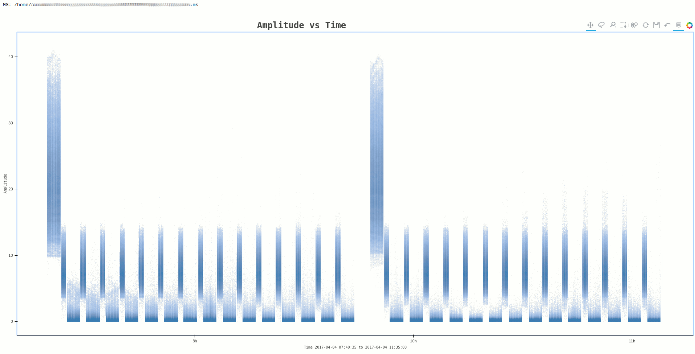
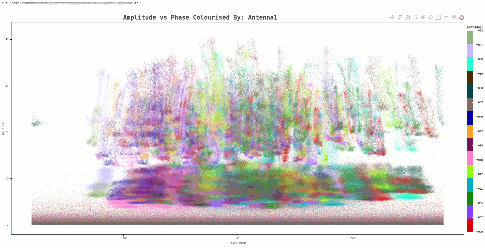
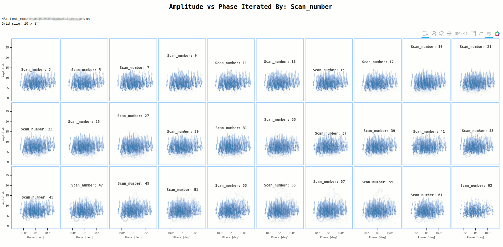
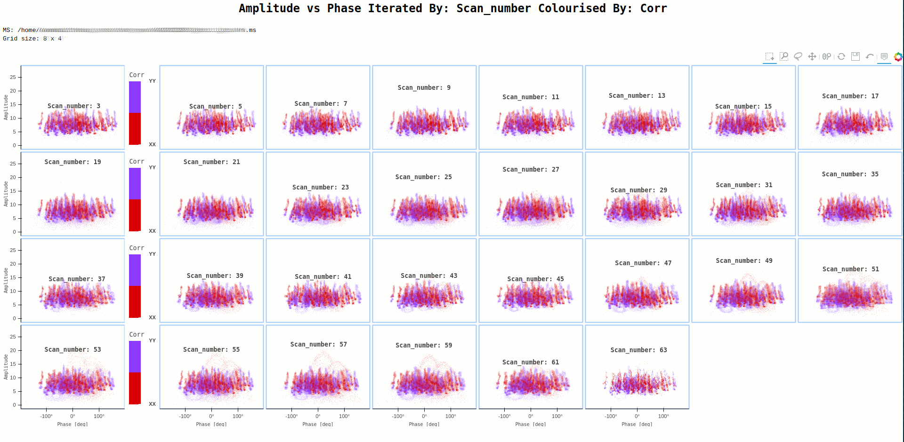
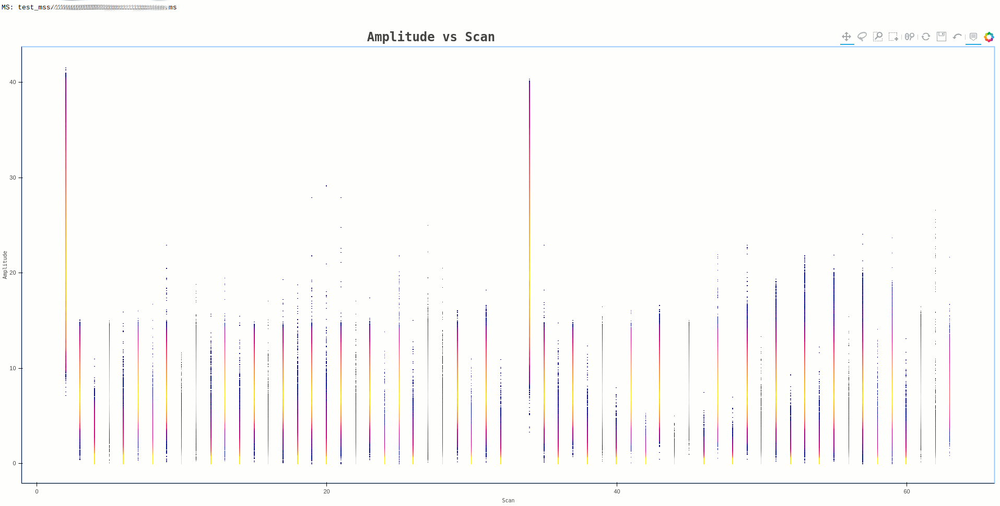
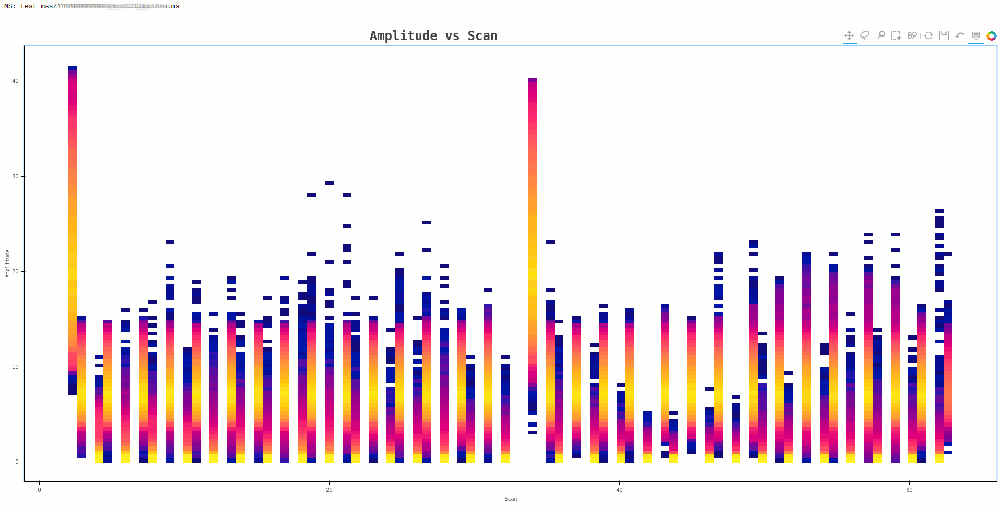

**************
``ragavi-vis``
**************
This is the visibility plotter. Supported arguments are as follows

+-----------------------------+---------------+--------------+-------------+
| xaxis                       | yaxis         | iter-axis    | colour-axis |
+=============================+===============+==============+=============+
| amplitude                   | amplitude     | antenna      | antenna1    |
+-----------------------------+---------------+--------------+-------------+
| antenna1                    | phase         | antenna1     | antenna2    |
+-----------------------------+---------------+--------------+-------------+
| antenna2                    | real          | antenna2     | spw         |
+-----------------------------+---------------+--------------+-------------+
| channel                     | imaginary     | baseline     | baseline    |
+-----------------------------+---------------+--------------+-------------+
| frequency                   |               | corr         | corr        |
+-----------------------------+---------------+--------------+-------------+
| imaginary                   |               | field        | field       |
+-----------------------------+---------------+--------------+-------------+
| phase                       |               | scan         | scan        |
+-----------------------------+---------------+--------------+-------------+
| real                        |               | spw          |             |
+-----------------------------+---------------+--------------+-------------+
| scan                        |               |              |             |  
+-----------------------------+---------------+--------------+-------------+
| time                        |               |              |             |
+-----------------------------+---------------+--------------+-------------+
| uvdistance (uv distamce m)  |               |              |             |
+-----------------------------+---------------+--------------+-------------+
| uvwave (uv distance lambda) |               |              |             |
+-----------------------------+---------------+--------------+-------------+

Some of the arguments can be shortened using the following aliases

+------------+--------------------+
| axis       | alias              |
+============+====================+
| amplitude  | amp                |
+------------+--------------------+
| antenna    | ant                |
+------------+--------------------+
| antenna1   | ant1               |
+------------+--------------------+
| antenna2   | ant2               |
+------------+--------------------+
| baseline   | bl                 |
+------------+--------------------+
| channel    | chan               |
+------------+--------------------+
| frequency  | freq               |
+------------+--------------------+
| imaginary  | imag               |
+------------+--------------------+
| uvdistance | uvdist             |
+------------+--------------------+
| uvwave     | uvidistl / uvdist_l|
+------------+--------------------+

Iteration can also be activated through the :code:`-ia / --iter-axis` option. 
It is also possible to colour over some axis (most of the iteration axes are 
supported as shown in the table above) and this can be activated through the 
:code:`-ca / --colour-axis` argument. Please note that the mandatory arguments are :code:`--xaxis`, :code:`--yaxis`, :code:`--ms`.

.. note::
    Output files genrated by ``ragavi-vis`` can be very large for iterated plots because of the resolution of each generated plot. For this reason, unless ``--canvas-width`` and ``--canvas-height`` are explicitly provided, ``ragavi-gains`` will automatically shrink the canvas sizes to 200 by 200 in order to minimise the resulting output.

Averaging
=========

``ragavi-vis`` has the ability to perform averaging before a plot is generated, by specifying the :code:`--cbin` or :code:`--tbin` arguments. These enable channel averaging and time averaging respectively. It is made possible through the use of the `Codex`_ africanus averaging API.

Averaging is performed over per SPW, FIELD and Scan. This means that data is grouped by DATA_DESC_ID, FIELD_ID and SCAN_NUMBER beforehand. However, data selection (such as selection of spws, fields, scans and baselines to be present) is done before the averaging to avoid processing data that is unnecessary for the plot. 

Computing Resources
===================

Number of computer cores to be used, memory per core and the size of chunks to be loaded to each core may also be specified using :code:`-nc / --num-cores`, :code:`-ml / --memory-limit` and :code:`-cs / --chunk-size` respectively. These may play an active role in improving the performance and memory management as ``ragavi-vis`` runs. However, finding an optimal combination may be a tricky task but is well worth while. 

By default, ``ragavi-vis`` will use a maximum of 10 cores, with the maximum memory associated to each core being 1GB, and a chunk size in the row axis as 5000. The number of cores to be used, however, is dependent on the amount of RAM that is available on the host machine, in order to try and ensure that: 

.. code:: bash
  
    Number of cores x memory limit per core < total amount of available RAM

This means that, if the number of cores is less than 10, then by default, ``ragavi-vis`` will attempt to match the number of cores to those available. 
Given that visibility data has the shape (rows x channels x correlations), chunk sizes may also be chosen per each dimension using comma separated values (see the `help`_ section on this page). As mentioned, the default chunk size is 5000 in the row axis, while the chunks sizes in the rest of the dimension are determined by the sizes of those dimensions (hence remaining as they are). Therefore, the true size of the chunks during processing will be translated to (nrows x nchannels x ncorrelations).

It is worth noting that supplying the x-axis and y-axis minimums and maximums may also significantly cut down the plotting time. This is because for minimum and maximum values to be calculated, ``ragavi-vis``' backends must pass through the entire dataset at least once before plotting begins and again as plotting continues, therefore, taking a longer time. While the effect of this may be minimal in small datasets, it is certainly amplified in large datasets.

Help
====

The output of the help is as follows:

.. code-block:: bash

    usage: ragavi-vis [options] <value>

    optional arguments:
      -h, --help            show this help message and exit
      -v, --version         show program's version number and exit

    Required arguments:
      --ms  [ ...]          MS to plot. Default is None
      -x , --xaxis          X-axis to plot
      -y , --yaxis          Y-axis to plot

  Plot settings:
    -ch , --canvas-height 
                          Set height resulting image. Note: This is not the plot
                          height. Default is 720
    -cw , --canvas-width 
                          Set width of the resulting image. Note: This is not
                          the plot width. Default is 1080.
    --cmap                Colour or colour map to use.A list of valid cmap
                          arguments can be found at:
                          https://colorcet.pyviz.org/user_guide/index.html Note
                          that if the argument "colour-axis" is supplied, a
                          categorical colour scheme will be adopted. Default is
                          blue.
    --cols                Number of columns in grid if iteration is active.
                          Default is 9.
    -ca , --colour-axis   Select column to colourise by. This will result in a
                          single image. Default is None.
    --debug               Enable debug messages
    -ia , --iter-axis     Select column to iterate over. This will result in a
                          grid. Default is None.
    -lf , --logfile       The name of resulting log file (with preferred
                          extension) If no file extension is provided, a '.log'
                          extension is appended. The default log file name is
                          ragavi.log
    -o , --htmlname       Output HTML file name (without '.html')

  Data Selection:
    -a , --ant            Select baselines where ANTENNA1 corresponds to the
                          supplied antenna(s). "Can be specified as e.g. "4",
                          "5,6,7", "5~7" (inclusive range), "5:8" (exclusive
                          range), 5:(from 5 to last). Default is all.
    --chan                Channels to select. Can be specified using syntax i.e
                          "0:5" (exclusive range) or "20" for channel 20 or
                          "10~20" (inclusive range) (same as 10:21) "::10" for
                          every 10th channel or "0,1,3" etc. Default is all.
    -c , --corr           Correlation index or subset to plot. Can be specified
                          using normal python slicing syntax i.e "0:5" for
                          0<=corr<5 or "::2" for every 2nd corr or "0" for corr
                          0 or "0,1,3". Can also be specified using comma
                          separated corr labels e.g 'xx,yy' or specifying 'diag'
                          / 'diagonal' for diagonal correlations and 'off-diag'
                          / 'off-diagonal' for of diagonal correlations. Default
                          is all.
    -dc , --data-column   MS column to use for data. Default is DATA.
    --ddid                DATA_DESC_ID(s) /spw to select. Can be specified as
                          e.g. "5", "5,6,7", "5~7" (inclusive range), "5:8"
                          (exclusive range), 5:(from 5 to last). Default is all.
    -f , --field          Field ID(s) / NAME(s) to plot. Can be specified as
                          "0", "0,2,4", "0~3" (inclusive range), "0:3"
                          (exclusive range), "3:" (from 3 to last) or using a
                          field name or comma separated field names. Default is
                          all
    -if, --include-flagged   Include flagged data in the plot. (Plots both flagged
                          and unflagged data.)
    -s , --scan           Scan Number to select. Default is all.
    --taql                TAQL where
    --xmin                Minimum x value to plot
    --xmax                Maximum x value to plot
    --ymin                Minimum y value to plot
    --ymax                Maximum y value to plot

  Averaging settings:
    --cbin                Size of channel bins over which to average .e.g
                          setting this to 50 will average over every 5 channels
    --tbin                Time in seconds over which to average .e.g setting
                          this to 120.0 will average over every 120.0 seconds

  Resource configurations:
    -cs , --chunks        Chunk sizes to be applied to the dataset. Can be an
                          integer e.g "1000", or a comma separated string e.g
                          "1000,100,2" for multiple dimensions. The available
                          dimensions are (row, chan, corr) respectively. If an
                          integer, the specified chunk size will be applied to
                          all dimensions. If comma separated string, these chunk
                          sizes will be applied to each dimension respectively.
                          Default is 5,000 in the row axis.
    -ml , --mem-limit     Memory limit per core e.g '1GB' or '128MB'. Default is
                          1GB
    -nc , --num-cores     Number of CPU cores to be used by Dask. Default is 10
                          cores. Unless specified, however, this value may
                          change depending on the amount of RAM on this machine
                          to ensure that: num-cores * mem-limit < total RAM
                          available

Examples
========
Some example plots generated by ``ragavi-vis``

Command:
:code:`ragavi-vis --ms dir/test.ms --xaxis time --yaxis amp`

Command:
:code:`ragavi-vis --ms dir/test.ms --xaxis phase --yaxis amp --colour-axis antenna1`

Command:
:code:`ragavi-vis --ms dir/test.ms --xaxis phase --yaxis amp --iter-axis scan`

Command:
:code:`ragavi-vis --ms dir/test.ms --xaxis phase --yaxis amp --iter-axis scan --colour-axis corr`

In some cases, the plot generated may have data points that are small and bordering invisible, such as the one below

Command:
:code:`ragavi-vis --ms dir/test.ms --xaxis scan --yaxis amp --cmap bmy`

A work around for such a case, is to reduce the resolution of the resulting 
image, by providing the ``--canvas-width`` and ``--canvas-height`` arguments.
The image above, was generating using the default values 1080 and 720 
respectively. If this is changed to 100 and 100, the resulting plot albeit 
coarse, is clearer as shown below

Command:
:code:`ragavi-vis --ms dir/test.ms --xaxis scan --yaxis amp --cmap bmy --canvas-width 100 --canvas-height 100`

.. _Codex: https://codex-africanus.readthedocs.io/en/latest/
.. _help: https://ragavi.readthedocs.io/en/dev/vis.html#help